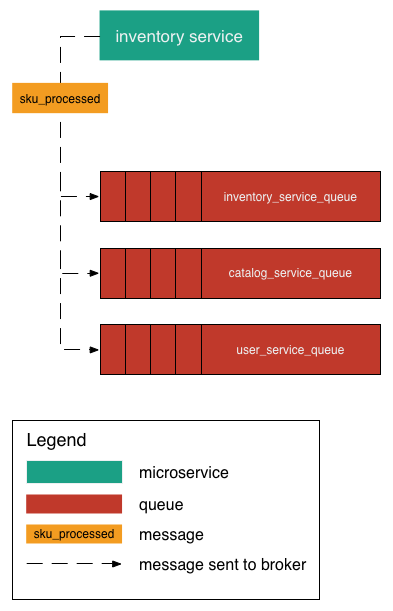

# nameko_poc
A POC of event based communication between microservices using nameko.

## What is this POC Doing?

This POC defines an event dispatcher called `Publisher`.  The publisher also has a simple HTTP endpoint for receiving a POST with a simple string used for the event message.  Upon receiving the POST, the publisher will dispatch an event with the post string as the event message.  Nameko uses [RabbitMQ](https://www.rabbitmq.com/) to dispatch the events.

This POC also define two types of consumers that will process events dispatched by the publisher.  The consumer types are `Consumer` and `ExtraSpecialConsumer`.  Upon receiving an event the consumers will print a message to the terminal.

We are trying to demonstrate multiple types of microservce that will listen for the same event but only one instance of the multiple microservice types will process an event at a time (Competing Consumers Pattern).

The diagram below is an example of the microservice messaging architecture we are attempting to demonstrate.

## Resources

[Namko Read The Docs](https://nameko.readthedocs.io/en/stable/index.html)

[RabbitMQ Docker Container](https://hub.docker.com/r/library/rabbitmq/)

[Communication between Microservices](http://howtocookmicroservices.com/communication/)

[Event-driven Microservices Using RabbitMQ](https://runnable.com/blog/event-driven-microservices-using-rabbitmq)

[Competing Consumers Messaging Pattern](http://www.enterpriseintegrationpatterns.com/patterns/messaging/CompetingConsumers.html
)

## Getting Started

Install the RabbitMQ Docker container via Kitematic or the docker command line.

`docker pull rabbitmq`

`docker run -d -p 5672:5672 rabbitmq`

Clone this [repo](https://github.com/TimGraf/nameko_poc) and change directories.

`git clone https://github.com/TimGraf/nameko_poc.git`

`cd nameko_poc`

Install nameko viv pip

`pip3 install nameko`

Start the Publisher in one terminal window.

`nameko run nameko_poc:Publisher`

Start one instance of the Consumer in another terminal window.

`nameko run nameko_poc:Consumer`

Start a second instance of the Consumer in another terminal window.

`nameko run nameko_poc:Consumer`

Start one instance of the ExtraSpecialConsumer in another terminal window.

`nameko run nameko_poc:ExtraSpecialConsumer`

Start a second instance of the ExtraSpecialConsumer in another terminal window.

`nameko run nameko_poc:ExtraSpecialConsumer`

Post a message string to the publisher's HTTP endpoint.

`curl -d "Hello World" -X POST http://localhost:8000/stuff`

From the curl POST you should get a simple text response of, `received: Hello World`.

Then verify that only one instance of each consumer type received the event from the publisher.  You will see similar output to the terminal from the consumers as follows for each consumer type.

### Consumer

`Consumer (Instance: 3060) received: Hello World`

### ExtraSpecialConsumer

`Extra Special Consumer (Instance: 3296) received: Hello World`

If you post another message string to the publisher's HTTP endpoint the second instance of each of the consumers should process the next event.

For instance, issue the following curl command.

`curl -d "Hello Jack" -X POST http://localhost:8000/stuff`

The following consumer types will produce the following output.

### Consumer

`Consumer (Instance: 3144) received: Hello Jack`

### ExtraSpecialConsumer

`Extra Special Consumer (Instance: 3372) received: Hello Jack`

The instance numbers for the consumer types is simply the PID for that process.  It's just a way to verify that only one consumer type instances is processing an event at a time.  So when you run this yourself, the PIDs will be different obviously.
